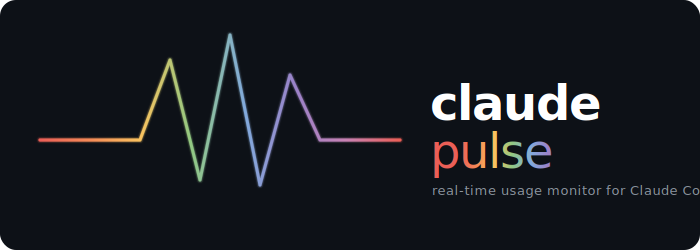

<p align="center">
  
</p>

<p align="center">
  Real-time usage monitor for Claude Code — session limits, weekly limits, cost tracking, peak hours, and 10 themes with animations. All in your status bar.
</p>

<p align="center">
  <a href="https://github.com/NoobyGains/claude-pulse/stargazers"></a>
  
  
  
  
  
  <a href="https://github.com/NoobyGains/claude-pulse/blob/main/LICENSE"></a>
  <a href="https://buymeacoffee.com/noobygains"></a>
</p>

---

## What is this?

A single-file Python status bar for Claude Code that shows everything you need at a glance — no API key required, zero dependencies, works with your existing Claude Code subscription.

<p align="center">
  
  <br>
  <sub>10 built-in themes with colour-coded bars that shift green → yellow → red as usage increases</sub>
</p>

<p align="center">
  
  <br>
  <sub>Rainbow animation — flowing gradient that shifts on every refresh</sub>
</p>

<p align="center">
  
  <br>
  <sub>Automatic update notifications for both claude-pulse and Claude Code</sub>
</p>

```
Session ━━━───────── 27% 2h 53m | Weekly ━━━━━━━━━─── 73% R:Fri 3pm | Context ━━━━──────── 35% | $38.75 | +142 -37 | In Peak ⚡2x 2h 54m left (1pm-7pm) | Opus 4.6 | [\] 320 tools 51m | main
```

## Features

| Feature | Description |
|---|---|
| **Session & Weekly bars** | Colour-coded progress bars (green → yellow → red) for 5-hour session and 7-day weekly limits |
| **Context window** | Live context usage percentage with pressure warnings at 70%/90% |
| **Cost tracking** | Real-time session cost in your local currency (USD, GBP, EUR, + 25 more) with live exchange rates |
| **Peak hours** | Configurable indicator for Anthropic's peak consumption window — red **In Peak ⚡** when limits burn faster, yellow when **approaching**, green **Off-Peak ✓** when limits stretch further. Full and minimal display modes |
| **Live heartbeat** | Spinning indicator with tool count and elapsed time (via PostToolUse hook) |
| **Git branch** | Current branch name always visible |
| **Model display** | Shows which model is active (Opus, Sonnet, Haiku) |
| **10 themes** | default, ocean, sunset, mono, neon, pride, frost, ember, candy, rainbow |
| **5 animation modes** | off, rainbow, pulse, glow, shift — each visually distinct |
| **8 bar styles** | classic, block, shade, pipe, dot, square, star, braille |
| **Lines changed** | Shows `+42 -7` in green/red — lines added and removed this session, read from stdin |
| **Cumulative cost** | Opt-in widget showing total API-equivalent cost across all sessions (cached, 5-min refresh) |
| **Widget priorities** | Every widget has a priority number — reorder them with `--priority model=5,cost=15` |
| **Focus timer** | Built-in focus timer — `--focus start 25` shows countdown in the status bar |
| **Auto-updates** | Notifies when a new version of claude-pulse or Claude Code is available |
| **Staleness indicator** | Shows data age when cached data is old |
| **Zero API calls** | Reads rate limits directly from Claude Code's stdin (v2.1.80+) — no OAuth, no rate limiting |

## Quick Start

### Plugin marketplace (recommended)

```
/plugin marketplace add NoobyGains/claude-pulse
/plugin install claude-pulse
```

Then run `/pulse` to configure. Restart Claude Code.

### One-liner install

**macOS / Linux:**
```bash
curl -fsSL https://raw.githubusercontent.com/NoobyGains/claude-pulse/main/install.sh | bash
```

**Windows (PowerShell):**
```powershell
irm https://raw.githubusercontent.com/NoobyGains/claude-pulse/main/install.ps1 | iex
```

### Manual install

```bash
git clone https://github.com/NoobyGains/claude-pulse.git ~/.claude-pulse
python3 ~/.claude-pulse/claude_status.py --install
```

Restart Claude Code. That's it.

### Enable the live heartbeat (optional)

The heartbeat shows a tool counter and elapsed time, updated on every tool call:

```bash
python3 ~/.claude-pulse/claude_status.py --install-hooks
```

Restart Claude Code for hooks to take effect.

## Configuration

Use `/pulse` in Claude Code for an interactive setup wizard, or configure directly:

```bash
# Themes
--theme ocean              # ocean, sunset, mono, neon, pride, frost, ember, candy, rainbow

# Animation
--animate rainbow          # rainbow, pulse, glow, shift, off
--animation-speed fast     # slow, normal, fast

# Display
--bar-size large           # small, small-medium, medium, medium-large, large
--bar-style block          # classic, block, shade, pipe, dot, square, star, braille
--layout compact           # standard, compact, minimal, percent-first

# Currency (auto-converts USD via live exchange rate)
--currency £               # $, £, €, ¥, C$, A$, ₹, kr, and 20+ more

# Peak hours (local time) — red in peak, green off-peak
--peak-hours 13:00-19:00   # Set your peak window
--peak-hours off           # Disable peak indicator
# Set "display": "minimal" in config for short format (⚡ Peak 2h)

# Clock
--clock-format 12h         # 12h or 24h

# Widget priority (lower = leftmost)
--priority                 # Show all widget priorities
--priority model=5,cost=15 # Move model first, cost after session

# Toggle features
--show lines               # Show +N/-N lines changed
--show burn_rate           # Show usage velocity (↑3%/hr)
--show git_drift           # Show commits ahead/behind
--show cumulative_cost     # Show total API-equivalent cost across all sessions
--show files_changed       # Show modified file count
--show last_tool           # Show last tool Claude used
--hide cost                # Hide cost ticker
--hide heartbeat           # Hide tool counter

# Focus timer
--focus start 25        # Start a 25-minute focus timer
--focus stop            # Stop the timer
--focus status          # Check remaining time

# Info
--config                   # Show current configuration
--stats                    # Show session statistics
--heatmap                  # Show activity heatmap
--update                   # Update to latest version
```

## How It Works

```
┌───────────────────────────────────────────────┐
│  Claude Code                                  │
│  Pipes JSON via stdin on every status refresh │
│  (model, context %, cost, rate_limits)        │
├───────────────────────────────────────────────┤
│  claude_status.py                             │
│  Reads stdin → builds ANSI status line        │
│  No API calls needed (v2.1.80+)               │
├───────────────────────────────────────────────┤
│  PostToolUse Hook (optional)                  │
│  Updates tool count, heartbeat, git branch    │
│  on every tool call                           │
├───────────────────────────────────────────────┤
│  Cache Layer                                  │
│  Exchange rates (24h) · cumulative cost (5m)  │
│  hook state (5m)                              │
│  Animation state · usage history              │
└───────────────────────────────────────────────┘
```

**Data flow:** Claude Code sends session JSON via stdin → claude-pulse reads rate limits directly (no API) → renders colourised ANSI status line → Claude Code displays it.

**Rate limits from stdin (v2.1.80+):** Claude Code now includes `rate_limits.five_hour` and `rate_limits.seven_day` in the stdin JSON, so claude-pulse no longer needs to call the Anthropic OAuth API. This eliminates rate limiting issues entirely.

**PostToolUse hook:** When installed, the hook fires on every tool call (Read, Edit, Bash, etc.), updating the heartbeat counter and git branch. The status line refreshes on each tool call, making the spinner animate during active work.

## Themes

<p align="center">
  
</p>

10 built-in themes with colour-coded bars that shift as usage increases. Set with `--theme <name>` or `/pulse <name>`.

## Animation Modes

| Mode | Effect |
|---|---|
| `off` | Static, no animation |
| `rainbow` | Flowing rainbow gradient across the entire bar |
| `pulse` | Bars cycle through vivid colours (cyan → blue → purple → pink → gold → green) |
| `glow` | Per-character gradient that shifts across the bar each frame |
| `shift` | Bright highlight slides across the bar |

Set with `--animate <mode>`. Animation moves on each status line refresh (interaction or tool call).

## Requirements

- **Python 3.6+** (no pip installs needed)
- **Claude Code** with a Pro or Max subscription
- No API key required — uses Claude Code's existing credentials

## Security

- **No API calls for usage data** — reads rate limits directly from Claude Code's stdin (v2.1.80+)
- OAuth tokens only used as fallback for extra credits/per-model caps, sent only to `api.anthropic.com` (hardcoded allowlist)
- All file writes use atomic operations with 0o600 permissions
- ANSI escape injection prevention on all external data
- No `shell=True` in any subprocess call
- Exchange rate API (frankfurter.app) — no auth, read-only, cached 24h

## Troubleshooting

| Issue | Fix |
|---|---|
| No status line visible | Run `--install` then restart Claude Code |
| "Rate limited" message | Update to v3.0.0+ — reads from stdin, no API calls needed |
| Heartbeat not showing | Run `--install-hooks` then restart Claude Code. Shows after first tool call |
| Heartbeat appears/disappears | Normal — shows when hook state is fresh (within 5 min of last tool call) |
| Settings error after hook install | Run `/doctor` — hooks need nested format: `{matcher, hooks: [{type, command}]}` |
| Stale data showing | Data refreshes on every interaction. If idle, it shows the last known state |
| Unicode characters broken | Try `--bar-style block` for better Windows terminal support |

## Support

If this project helped you, consider starring the repo, sharing it with others, or buying me a coffee.

<a href="https://buymeacoffee.com/noobygains"></a>

## Star History

<a href="https://star-history.com/#NoobyGains/claude-pulse&Date">
   <picture>
     <source media="(prefers-color-scheme: dark)" srcset="https://api.star-history.com/svg?repos=NoobyGains/claude-pulse&type=Date&theme=dark" />
     <source media="(prefers-color-scheme: light)" srcset="https://api.star-history.com/svg?repos=NoobyGains/claude-pulse&type=Date" />
     
   </picture>
</a>

## License

MIT — see [LICENSE](LICENSE) for details.

---

<p align="center">
  Made by <a href="https://github.com/NoobyGains">NoobyGains</a> · <a href="https://www.reddit.com/user/PigeonDroid/">PigeonDroid</a>
</p>
