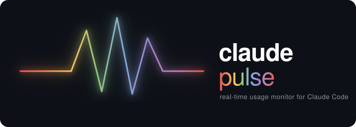
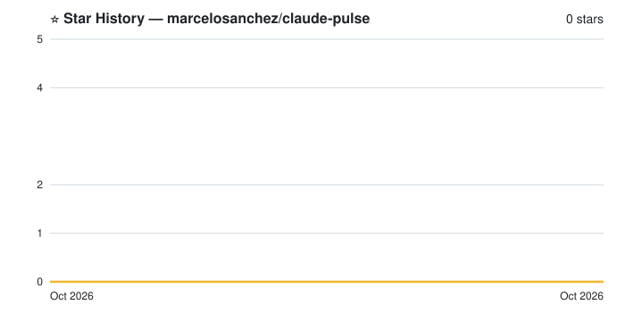

<p align="center">
  
</p>

<p align="center">
  Real-time usage monitor for Claude Code — session limits, weekly limits, per-model caps (Opus/Sonnet/Fable), cost tracking, and 11 themes with animations. All in your status bar.
</p>

<p align="center">
  <a href="https://github.com/NoobyGains/claude-pulse/stargazers"></a>
  
  
  
  
  
  <a href="https://github.com/NoobyGains/claude-pulse/blob/main/LICENSE"></a>
  <a href="https://buymeacoffee.com/noobygains"></a>
</p>

---

## What is this?

A single-file Python status bar for Claude Code that shows everything you need at a glance — no API key required, zero dependencies, works with your existing Claude Code subscription.

<p align="center">
  
  <br>
  <sub>11 built-in themes with colour-coded bars that shift green → yellow → red as usage increases</sub>
</p>

<p align="center">
  
  <br>
  <sub>Rainbow animation — flowing gradient that shifts on every refresh</sub>
</p>

<p align="center">
  
  <br>
  <sub>Automatic update notifications for both claude-pulse and Claude Code</sub>
</p>

```
Session ━━━───────── 27% 2h 53m | Weekly ━━━━━━━━━─── 73% R:Fri 3pm | Fable ━━───────── 18% | Context ━━━━──────── 35% | $38.75 | +142 -37 | Opus 5 | Effort: XHigh | ⚡fast | main
```

## What's new in 3.3.0

- **Sonnet 5 priced at its now-permanent $2/$10 rate** — Anthropic cancelled the scheduled September increase to $3/$15. Historical turns are priced by their own date either way, so a promo lapsing can never retroactively inflate the cost widgets.
- **GitLab merge requests render as `!N`** via the `pr.kind` stdin field (Claude Code 2.1.234+); GitHub PRs keep `#N`.
- **MiniMax quota works on Windows** — npm installs `mmx` as a `.cmd` shim that `subprocess` won't auto-resolve; the call now goes through a PATH lookup (thanks @PFalko, #50).
- **The repaint timer heals itself** — a focus timer expiring on its own or a heartbeat going stale no longer leaves the 15s timer armed, and a heartbeat waking from idle arms it immediately.
- **Self-hosted star chart** — GitHub restricted the stargazers API to repo collaborators, so the README chart is rendered weekly by a workflow with the repo's own token and committed as static SVGs.
- **Fable weekly cap** — read from the model-scoped `limits` the API reports, so new models are picked up without a code change.
- **Claude 5-era stdin fields** — reasoning effort, `⚡fast` mode, thinking state, active subagent, PR badge, and cache-hit ratio.
- **Fixed: the refresh timer never worked.** Every version up to 3.1.0 wrote a `refresh` key that Claude Code does not have, so it was silently ignored — animations, the heartbeat and the focus countdown froze whenever the session went idle. The real setting is `refreshInterval`, and it is now set only when something time-based is on screen.
- **~40% faster repaints** (204ms → 118ms): `claude --version` and `git rev-parse` were both running on *every* repaint just to validate hourly caches.
- **Per-model bars no longer invent data** — Claude Pro reports `null` for the model-scoped windows, and 3.1.0 drew a hardcoded `Sonnet 0%` bar in that case.
- **Zero API calls, for real** — the per-model caps arrive on stdin, but 3.1.0 discarded them and re-fetched over OAuth. That call is gone.
- **Two-line layout**, rolling **7-day cost** widget, `CLAUDE_CONFIG_DIR` support, exponential backoff on 429, and an update check that no longer nags forks forever.
- **Corrupt state can't blank the bar** — a truncated or hand-edited cache/settings file used to raise on the hot path. Every state read now degrades to a cache miss instead, and one malformed rate-limit field no longer discards the windows after it.
- **Subagent panel rows** via `subagentStatusLine`, a live agent counter from the `SubagentStart`/`SubagentStop` hooks, and an opt-in budget bar.
- **The heartbeat is now opt-in** — the `[/] 42 tools 5m` spinner is noise for most people, needs a hook, and kept the repaint timer alive. `--show heartbeat` brings it back.
- **Peak hours removed.**

Python floor is **3.8** — 3.1.0 advertised 3.6+ but did not parse below 3.12. Test suite: 21 → 204.

## Features

| Feature | Description |
|---|---|
| **Session & Weekly bars** | Colour-coded progress bars (green → yellow → red) for 5-hour session and 7-day weekly limits |
| **Context window** | Live context usage percentage with pressure warnings at 70%/90% |
| **Cost tracking** | Real-time session cost in your local currency (USD, GBP, EUR, + 25 more) with live exchange rates |
| **Per-model weekly caps** | Separate bars for Opus, Sonnet and **Fable** weekly budgets, read from the model-scoped limits the API reports. Shown only when your plan actually reports them |
| **Effort & fast mode** | Reasoning effort, written as `Effort: Medium` by default and colour-escalating with the level (`--effort-format full`/`short` for `Medium`/`med`), plus a **⚡fast** badge while Opus fast mode is on |
| **Subagent & PR** | Active subagent name, plus an opt-in clickable PR badge with review state (OSC 8 hyperlink) |
| **Cache efficiency** | Opt-in indicator for the share of input served from cache — the clearest cost signal on stdin |
| **Two-line layout** | Split widgets across two rows with `line1_widgets` / `line2_widgets` |
| **Subagent rows** | Custom per-agent rows in the agent panel via `subagentStatusLine` — status, model, effort, a context bar from `tokenCount`/`contextWindowSize`, and elapsed time |
| **Live agent counter** | `agents 3 live · 47/200` from `SubagentStart`/`SubagentStop` hooks, colour-escalating toward the caps |
| **Budget bar** | Spend against a ceiling you set with `--budget` to match your `--max-budget-usd` |
| **Live heartbeat** | Opt-in spinner with tool count and elapsed time — `--show heartbeat` plus `--install-hooks` |
| **Git branch** | Current branch name always visible |
| **Model display** | Shows which model is active (Fable, Opus, Sonnet, Haiku) |
| **11 themes** | default, dark, ocean, sunset, mono, neon, pride, frost, ember, candy, rainbow |
| **5 animation modes** | off, rainbow, pulse, glow, shift — each visually distinct |
| **8 bar styles** | classic, block, shade, pipe, dot, square, star, braille |
| **Lines changed** | Shows `+42 -7` in green/red — lines added and removed this session, read from stdin |
| **Cumulative cost** | Opt-in widget showing total API-equivalent cost across all sessions (cached, 5-min refresh) |
| **Widget priorities** | Every widget has a priority number — reorder them with `--priority model=5,cost=15` |
| **Focus timer** | Built-in focus timer — `--focus start 25` shows countdown in the status bar |
| **Auto-updates** | Notifies when a new version of claude-pulse or Claude Code is available |
| **Staleness indicator** | Shows data age when cached data is old |
| **Zero API calls** | Reads rate limits directly from Claude Code's stdin (v2.1.80+) — no OAuth, no rate limiting |

## Quick Start

### Plugin marketplace (recommended)

```
/plugin marketplace add NoobyGains/claude-pulse
/plugin install claude-pulse
```

Then run `/pulse` to configure. Restart Claude Code.

### One-liner install

**macOS / Linux:**
```bash
curl -fsSL https://raw.githubusercontent.com/NoobyGains/claude-pulse/main/install.sh | bash
```

**Windows (PowerShell):**
```powershell
irm https://raw.githubusercontent.com/NoobyGains/claude-pulse/main/install.ps1 | iex
```

### Manual install

```bash
git clone https://github.com/NoobyGains/claude-pulse.git ~/.claude-pulse
python3 ~/.claude-pulse/claude_status.py --install
```

Restart Claude Code. That's it.

### Enable the live heartbeat (optional)

The heartbeat shows a tool counter and elapsed time, updated on every tool call:

```bash
python3 ~/.claude-pulse/claude_status.py --install-hooks
```

Restart Claude Code for hooks to take effect.

## Configuration

Use `/pulse` in Claude Code for an interactive setup wizard, or configure directly:

```bash
# Themes
--theme ocean              # dark, ocean, sunset, mono, neon, pride, frost, ember, candy, rainbow

# Animation
--animate rainbow          # rainbow, pulse, glow, shift, off
--animation-speed fast     # slow, normal, fast

# Display
--bar-size large           # small, small-medium, medium, medium-large, large
--bar-style block          # classic, block, shade, pipe, dot, square, star, braille
--layout compact           # standard, compact, minimal, percent-first
--wrap auto                # off (default, truncate) or auto (wrap to 2 lines at | when narrow)

# Two-line layout (config.json) — deliberate split, unlike --wrap's overflow handling.
#   "line2_widgets": ["model", "effort", "branch"]   push these to row 2
#   "line1_widgets": ["session", "weekly"]           allowlist row 1, rest flows to row 2
# line1_widgets wins if both are set.

# Currency (auto-converts USD via live exchange rate)
--currency £               # $, £, €, ¥, C$, A$, ₹, kr, and 20+ more

# Budget (Claude Code's --max-budget-usd is CLI-only and can't be read from
# here, so set the same number to track spend against it)
--budget 25                # or: --budget off

# Caps shown as denominators. Claude Code enforces these but doesn't report
# them, so set them to match your setup. 0 hides that denominator.
--limits                   # show current values
--limits subagent_spawns=200,subagent_concurrent=20,web_searches=200

# Effort display (how the reasoning-effort level is written)
--effort-format labeled    # labeled (default) 'Effort: Medium' · full 'Medium' · short 'med'

# Clock and timers
--clock-format 12h         # 12h or 24h
--weekly-timer-format auto # auto, countdown, date
--weekly-timer-prefix "R:" # text before the weekly reset time

# Other display options
--context-format percent   # percent or tokens (155k/1M)
--max-width 80             # % of terminal width the bar may use
--extra-display auto       # auto, full, amount, minimal (bonus credits)
--streak-style fire        # how the daily streak is drawn
--show-all                 # preview every widget at once

# Widget priority (lower = leftmost)
--priority                 # Show all widget priorities
--priority model=5,cost=15 # Move model first, cost after session

# Toggle features
--show lines               # Show +N/-N lines changed
--show burn_rate           # Show usage velocity (↑3%/hr)
--show git_drift           # Show commits ahead/behind
--show cumulative_cost     # Show total API-equivalent cost across all sessions
--show weekly_cost         # Show rolling 7-day API-equivalent cost
--show cache               # Show % of input served from cache (cost signal)
--show pr                  # Show clickable PR badge + review state
--show thinking            # Show whether extended thinking is on
--show files_changed       # Show modified file count
--show last_tool           # Show last tool Claude used
--hide cost                # Hide cost ticker
--hide heartbeat           # Hide tool counter
--hide fable               # Hide the Fable weekly cap bar
--hide fast_mode           # Hide the ⚡fast badge
--hide agent               # Hide the active subagent name
--hide subagents           # Hide the live agent counter
--hide budget              # Hide the budget bar

# Internal (invoked by Claude Code, not by you):
#   --subagent-status-line   renders the agent-panel rows
#   --hook-refresh           PostToolUse heartbeat
#   --hook-subagent-start/-stop   live agent counter
#   --debug-stdin            dump the raw stdin payload for troubleshooting

# Focus timer
--focus start 25        # Start a 25-minute focus timer
--focus stop            # Stop the timer
--focus status          # Check remaining time

# Info
--config                   # Show current configuration
--stats                    # Show session statistics
--heatmap                  # Show activity heatmap
--update                   # Update to latest version
```

## How It Works

```
┌───────────────────────────────────────────────┐
│  Claude Code                                  │
│  Pipes JSON via stdin on every status refresh │
│  (model, context, cost, rate_limits, effort,  │
│   fast_mode, agent, pr, version)              │
├───────────────────────────────────────────────┤
│  claude_status.py                             │
│  Reads stdin → builds ANSI status line        │
│  No API calls needed (v2.1.80+)               │
├───────────────────────────────────────────────┤
│  PostToolUse Hook (optional)                  │
│  Updates tool count, heartbeat, git branch    │
│  on every tool call                           │
├───────────────────────────────────────────────┤
│  Cache Layer                                  │
│  Exchange rates (24h) · update checks (1h)    │
│  cumulative + weekly cost (5m) · hook (5m)    │
│  429 backoff · animation state · history      │
└───────────────────────────────────────────────┘
```

**Data flow:** Claude Code sends session JSON via stdin → claude-pulse reads rate limits directly (no API) → renders colourised ANSI status line → Claude Code displays it.

**Rate limits from stdin (v2.1.80+):** Claude Code sends `rate_limits` on stdin — the 5-hour and 7-day windows plus the model-scoped weekly caps (`seven_day_opus`, `seven_day_sonnet`, `seven_day_fable`). claude-pulse reads all of them straight from stdin, so no OAuth call is needed for the bars. The API is only consulted for extra/bonus credits, which stdin doesn't carry, and a 429 there now backs off exponentially instead of retrying on every repaint.

**Refresh cadence:** Claude Code repaints on its own events (prompt, tool use), which covers anything derived from stdin. Content that moves with the clock — animation frames, the focus countdown, the heartbeat's elapsed time — also needs a timer, so `--install` sets `statusLine.refreshInterval` (2s when animating, 15s for time-based widgets, omitted entirely for a static bar). It is re-synced automatically whenever you change a setting.

**PostToolUse hook:** When installed, the hook fires on every tool call (Read, Edit, Bash, etc.), updating the heartbeat counter and git branch. The status line refreshes on each tool call, making the spinner animate during active work.

## Themes

<p align="center">
  
</p>

11 built-in themes with colour-coded bars that shift as usage increases. Set with `--theme <name>` or `/pulse <name>`.

## Animation Modes

| Mode | Effect |
|---|---|
| `off` | Static, no animation |
| `rainbow` | Flowing rainbow gradient across the entire bar |
| `pulse` | Bars cycle through vivid colours (cyan → blue → purple → pink → gold → green) |
| `glow` | Per-character gradient that shifts across the bar each frame |
| `shift` | Bright highlight slides across the bar |

Set with `--animate <mode>`. Animation advances on every repaint — Claude Code's own events plus the 2-second `refreshInterval` that `--install` configures while animation is on, so the bar keeps moving even while the session is idle.

## Requirements

- **Python 3.8+** (no pip installs needed)
- **Claude Code** v2.1.80+ with a Pro or Max subscription (Fable reporting needs v2.1.170+)
- No API key required — uses Claude Code's existing credentials

## Security

- **No API calls for usage data** — reads rate limits directly from Claude Code's stdin (v2.1.80+)
- OAuth tokens only used as fallback for extra credits/per-model caps, sent only to `api.anthropic.com` (hardcoded allowlist)
- All file writes use atomic operations with 0o600 permissions
- ANSI escape injection prevention on all external data
- Hyperlink targets (PR badge) restricted to `http(s)` and rejected if they contain control characters, so nothing can break out of the OSC 8 escape
- No `shell=True` in any subprocess call
- Exchange rate API (frankfurter.app) — no auth, read-only, cached 24h

## Troubleshooting

| Issue | Fix |
|---|---|
| No status line visible | Run `--install` then restart Claude Code |
| "Rate limited" message | v3.0.0+ reads limits from stdin, so the bars keep working. v3.2.0+ also backs off exponentially before retrying the API |
| Animation/timer frozen when idle | Re-run `--install` on v3.2.0+. Earlier versions wrote a `refresh` key that Claude Code ignores; the real setting is `refreshInterval` |
| Opus/Sonnet/Fable bar missing | Those bars render only when your plan reports that cap. Claude Pro returns `null` for the model-scoped windows |
| Heartbeat not showing | Run `--install-hooks` then restart Claude Code. Shows after first tool call |
| Heartbeat appears/disappears | Normal — shows when hook state is fresh (within 5 min of last tool call) |
| Settings error after hook install | Run `/doctor` — hooks need nested format: `{matcher, hooks: [{type, command}]}` |
| Stale data showing | Data refreshes on every interaction. If idle, it shows the last known state |
| Unicode characters broken | Try `--bar-style block` for better Windows terminal support |

## Support

If this project helped you, consider starring the repo, sharing it with others, or buying me a coffee.

<a href="https://buymeacoffee.com/noobygains"></a>

## Star History

<!-- Rendered weekly by .github/workflows/star-history.yml — GitHub restricted
     the stargazers API (June 2026), so third-party live charts no longer work
     for public visitors; the repo renders and commits its own. -->
<a href="https://github.com/NoobyGains/claude-pulse/stargazers">
   <picture>
     <source media="(prefers-color-scheme: dark)" srcset="assets/star-history-dark.svg" />
     <source media="(prefers-color-scheme: light)" srcset="assets/star-history.svg" />
     
   </picture>
</a>

## License

MIT — see [LICENSE](LICENSE) for details.

---

<p align="center">
  Made by <a href="https://github.com/NoobyGains">NoobyGains</a> · <a href="https://www.reddit.com/user/PigeonDroid/">PigeonDroid</a>
</p>
